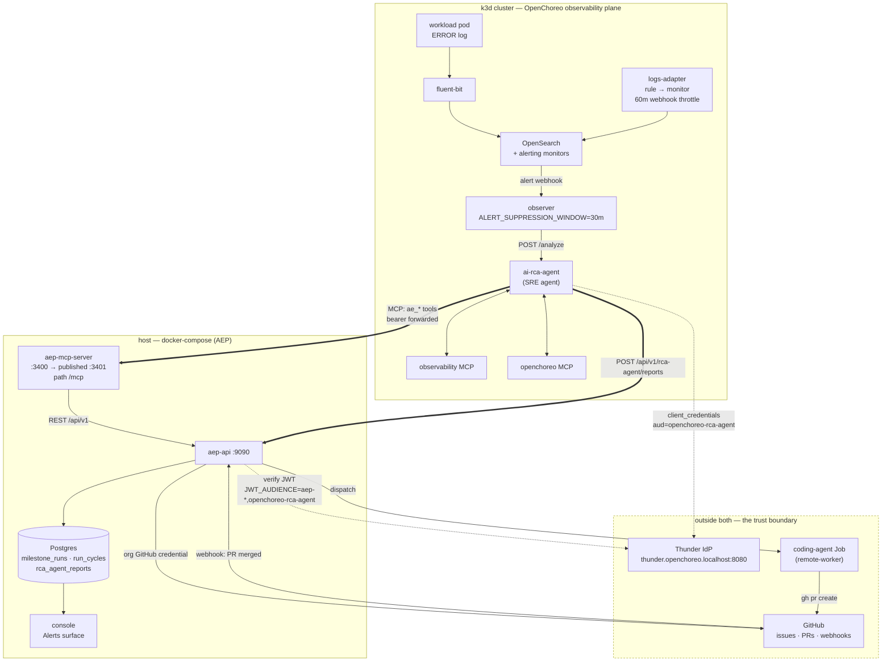
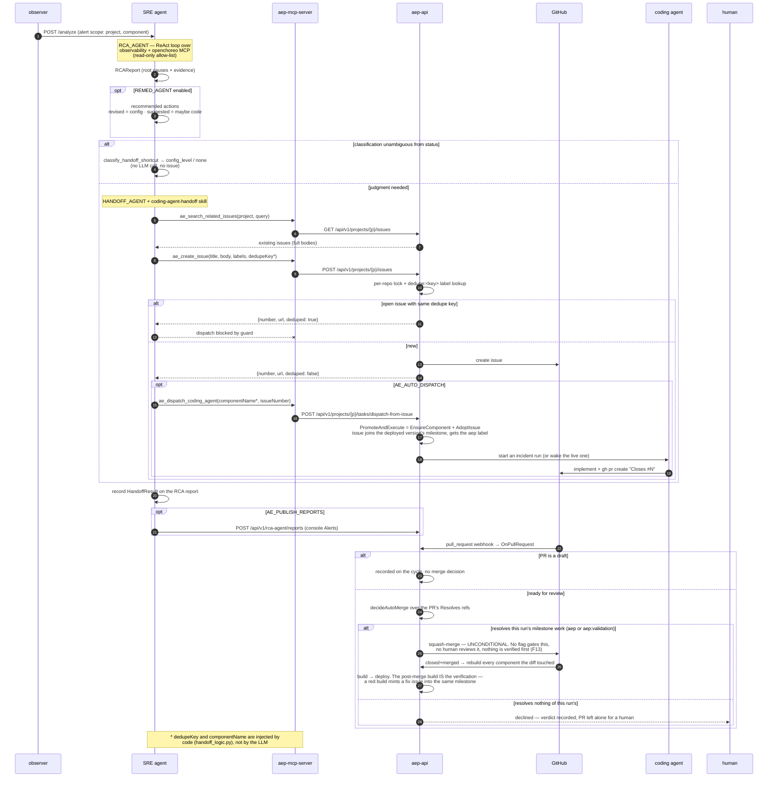
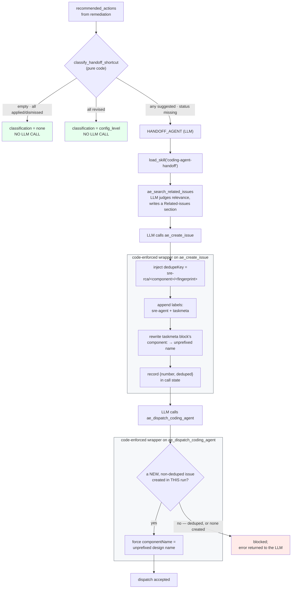
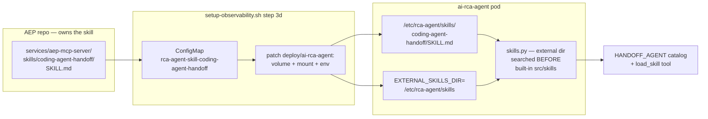

# SRE-agent ↔ AEP handoff — review guide

How to review the OpenChoreo SRE (RCA) agent and its handoff into the AEP coding
agent. The feature spans **two repos** and its correctness lives in the seam
between them, so a single-repo diff review will miss most of what matters.

- **Runbook** (how to run it): [`sre-handoff-runbook.md`](./sre-handoff-runbook.md)
- **Security** (how it is protected, and where it isn't): [`sre-handoff-security.md`](./sre-handoff-security.md)
- **Design record** (why it looks like this): `openchoreo/agents/sre-agent/AE-HANDOFF-DESIGN.md`
- **This file**: how to *review* it — scope, diagrams, lanes, pre-seeded findings, exit criteria.

---

## 1. What is under review

| Side | Path | Language | Owns |
|---|---|---|---|
| OpenChoreo | `agents/sre-agent` | Python (FastAPI + LangChain/LangGraph) | RCA / remediation / handoff stages, error fingerprint, skill loader, report publisher |
| AEP | `services/aep-mcp-server` | TypeScript | Streamable-HTTP MCP wrapper exposing the 3 `ae_*` tools |
| AEP | `services/aep-api/internal/sourcecontrol` | Go | issue create/search, dedupe label + per-repo lock, GitHub credentials |
| AEP | `services/aep-api/internal/delivery/task` | Go | `PromoteAndExecute` — ad-hoc issue → milestone adoption → incident run |
| AEP | `services/aep-api/internal/ops` | Go | RCA report store → console Alerts surface |
| AEP | `tools/aectl/cmd/sre*.go` | Go | `aectl sre install/status/uninstall` |
| AEP | `deployments/scripts/setup-observability.sh` | Bash (861 lines) | the actual deploy-time wiring: images, ConfigMaps, skill mount |

**Ownership boundary to hold in your head while reviewing:** the SRE agent never
holds GitHub credentials and never merges. It holds *one* capability — "file an
issue and ask AEP to dispatch" — and everything else is AEP's.

### Freeze the review inputs first

```bash
# OpenChoreo side
cd <openchoreo> && git rev-parse HEAD && git log --oneline main..HEAD
git diff --stat main...HEAD -- agents/sre-agent

# AEP side
cd <labs-agentic-engineer> && git rev-parse HEAD
git log --oneline --since=2026-07-01 -- services/aep-mcp-server \
  services/aep-api/internal/sourcecontrol services/aep-api/internal/ops \
  tools/aectl/cmd deployments/scripts/setup-observability.sh
```

Record both SHAs in the review notes. The AEP side is largely **already on
`main`** while the OpenChoreo side is on a feature branch — so "review the diff"
means different things per repo, and the cross-repo contract is only pinned by
the SHA pair you write down.

---

## 2. Diagrams

Each diagram is inline mermaid (renders on GitHub, and diffs when the design
changes) **and** exported to a standalone PNG under
[`images/`](./images/) for slides, printing, and pasting into review notes. If
you edit a mermaid block, re-export — see [§8](#8-regenerating-the-png-exports).

### 2.1 Topology — who talks to whom, and over which trust boundary

📎 PNG: [`images/sre-handoff-topology.png`](./images/sre-handoff-topology.png)



Two facts this diagram is the whole point of:

1. **`AE_API_URL` and `AEP_API_URL` are different hosts.** `AE_API_URL`
   (`:3401`) is the MCP wrapper; `AEP_API_URL` (`:9090`) is aep-api direct, used
   only for RCA-report publishing. Confusing them is a silent misconfiguration —
   the handoff tools 404 while report publishing still works, or vice versa.
2. **Everything crossing the boundary carries the SRE agent's own Thunder
   client-credentials token.** `aep-mcp-server` is stateless and forwards it
   verbatim; the acting org comes from the verified `ouHandle` claim, never from
   the request.

### 2.2 The handoff, end to end

📎 PNG: [`images/sre-handoff-sequence.png`](./images/sre-handoff-sequence.png)



### 2.3 Deterministic code vs. LLM judgment

This split is the single highest-value thing to review. `handoff_logic.py`
exists precisely so that the invariants are structural rather than prompt
instructions an off-prompt response can skip.

📎 PNG: [`images/sre-handoff-guardrails.png`](./images/sre-handoff-guardrails.png)



Review question for each box in `WC` / `WD`: *if the LLM did the opposite, what breaks,
and is the code the only thing stopping it?* Every one of those wrappers exists
because a live run got it wrong — the git history is the evidence trail.

### 2.4 Config and skill delivery (the part that silently breaks)

📎 PNG: [`images/sre-handoff-skill-delivery.png`](./images/sre-handoff-skill-delivery.png)



Three coupled preconditions, any one of which fails quietly:

- the image carries the external-skills loader and no baked-in copy of the skill,
- the ConfigMap exists and its source files were found by the script,
- `EXTERNAL_SKILLS_DIR` is set on the deployment.

Get two of three and you get either a stale skill silently winning or
`Skill 'coding-agent-handoff' not found`.

The first precondition used to read "image tag ≥ `handoff-v15`". That version
scheme belongs to `tharindulak/openchoreo-sre-agent`, which has not been pushed
since 2026-07-22; the installer uses `tharindulak/sre-agent`, whose tags are
feature names (`handoff-provider`) that no `≥` can order. Check the image
itself. It ships without a shell, so read its filesystem rather than exec into
it:

```bash
docker create --name probe tharindulak/sre-agent:<tag>
docker export probe | tar -tf - | grep -E '^app/src/(agent/skills\.py|skills/)'
docker rm -f probe
```

Expect `app/src/agent/skills.py` (the loader) and **no** `app/src/skills/` (the
baked-in library that would otherwise win over the mount). Both confirmed on
`handoff-provider`.

### 2.5 Security

Trust zones, identity, what actually contains the coding agent, and the
human-in-the-loop question all live in a separate document:
**[`sre-handoff-security.md`](./sre-handoff-security.md)**.

Read it before the walkthrough. Its §4 changes what this review has to establish:
the design's headline safety claim ("no auto-merge; the PR is the human gate") is
**not** in force on the default local stack. That is finding **F13**.

---

## 3. Review lanes

Seven lanes. Each is independently assignable; each has entry points, the
questions that actually matter, and a pass bar.

### L1 — Contract & topology coherence
**Entry:** `AE-HANDOFF-DESIGN.md` §4, §7, §A2 · `services/aep-mcp-server/src/server.ts`
· `src/config.py` (`ae_api_url`, `ae_mcp_path`, `aep_api_url`) · `deployments/docker-compose.yml`

- Do the three tool contracts in the design table match `server.ts`'s schemas
  and `aepClient.ts`'s request shapes, field for field?
- Does the design doc describe the topology that is actually deployed? (See
  finding **F2** — it does not.)
- Is there one authoritative statement of "which URL is which port"?
- **F12**: should the SRE side depend on AEP by name at all, or on a pluggable
  downstream-system interface? Cheap to ask now, expensive later.

**Pass bar:** the design doc, `server.ts`, and `setup-observability.sh` agree on
host, port, path, and payload for all three tools with no reader inference.

### L2 — Idempotency
**Entry:** `src/agent/fingerprint.py` · `dedupe_key_for` · `sourcecontrol/issue_service.go`
(`createLocks`, `dedupeLabelFor`) · `issue_dedup_test.go`

One incident must yield one issue and one dispatch. Two open questions, F5 and F6.
Everything else is covered by the live check in §5.3 steps 3 and 4 — one issue for
a repeat, a second issue for a genuinely different error.

**Pass bar:** the guarantee is stated in prose with its scope and failure mode, and
§5.3 steps 3–4 pass on a real run.

### L3 — Security
**Entry:** **[`sre-handoff-security.md`](./sre-handoff-security.md)** — read it whole;
it is the deliverable for this lane

- Confirm §4: is `AUTO_MERGE_CODING_PRS` false in every deployment that is not a
  local demo? (**F13** — this is the lane's blocking question.)
- Confirm §6: does anything mask telemetry before it reaches a GitHub issue body
  or `rca_agent_reports`? (**F11**)
- Confirm §5: any mitigation for untrusted issue text reaching the agent? (**F8**)
- Confirm §2: is the `JWT_AUDIENCE` widening a conscious decision, or should the
  RCA audience be scoped to the handoff surface?

**Pass bar:** the security doc's §9 table is agreed, and items 1 and 2 have owners.

### L4 — Determinism split
**Entry:** `handoff_logic.py` (whole file) · `handoff_agent_prompt.j2` ·
`skills/coding-agent-handoff/SKILL.md` · `tests/test_fingerprint.py`, `tests/test_skills.py`

- For each wrapper in §2.3's `WC` / `WD` boxes: is it enforced in code, *and* is the
  now-redundant prompt instruction either removed or explicitly kept as
  belt-and-braces with a comment saying so?
- `_parse_tool_result` handles dict / str / content-block list. That third shape
  was a live bug. Is it tested against the *real* adapter's shape, not a fake?
- `classify_handoff_shortcut` returns `None` (defer to LLM) when any status is
  missing. Is "remediation disabled entirely" the right case to spend an LLM
  call on, or should it short-circuit?

**Pass bar:** every invariant is either code-enforced with a test, or documented
as best-effort. No invariant lives only in a prompt.

### L5 — Cross-repo coupling & drift
**Entry:** `TASKMETA_LABELS` / `_ensure_taskmeta_block` in `handoff_logic.py` ·
`internal/contracts/taskmeta/execution.go` · `internal/delivery/labels.go` ·
`design_component_name` · `PromoteAndExecute`

- This is where finding **F1** lives, and it is the most likely real defect.
- `design_component_name` strips a `<project>-` prefix. What happens for a
  component whose name legitimately starts with the project name
  (`demo` / `demo-demo-svc`)? Is the collision reachable?
- The whole flow assumes **OC project slug == AEP project slug**. Where is that
  asserted, and what is the error when it does not hold?
- `PromoteAndExecute` requires the component to exist in AEP's design at HEAD,
  so the handoff only works for AEP-created components (finding **F10**). Does
  it fail loudly and legibly?

**Pass bar:** every cross-repo assumption is either validated at runtime with a
clear error, or asserted by a test in one of the two repos.

### L6 — Deploy & operability
**Entry:** `setup-observability.sh` · `tools/aectl/cmd/sre.go` · `sre_status.go` ·
`deployments/helm-charts/design/sre-agent-install.md`

- Findings **F3** (personal registries), **F4** (two installers), **F7** (token-fetch
  retry and the silent-drop path) and **F9** (throughput ceilings) all live here.
  F7 is the one to prioritise: a silently dropped incident is this system's worst
  failure mode.
- `--force-conflicts` on the helm upgrade plus post-helm `kubectl patch` is a
  deliberate ownership fight. Is the comment's reasoning sound, and is it the
  same in both installers?
- Can an operator tell, from `aectl sre status` alone, whether the handoff is
  actually wired (skill mounted, audience extended, MCP reachable)?
- Rollback: what undoes a handoff-enabled install?

**Pass bar:** one authoritative install path, no personal registries in
defaults, and a status command that proves wiring rather than liveness.

### L7 — Tests & evidence
**Entry:** `tests/test_fingerprint.py`, `tests/test_skills.py` (both new) ·
`issue_service_test.go`, `issue_dedup_test.go`, `issue_search_test.go` ·
`internal/arch/domain_arch_test.go`

- `AE-HANDOFF-DESIGN.md` §13 is honest that the original test plan was replaced
  by "existing toolchains plus live checks". Which of those gaps are now closed
  by the two new Python test files, and which are still open?
- Is there **any** automated test that exercises the SRE↔AEP contract? A
  contract test against a recorded `aep-mcp-server` response would catch F1 and
  F2 mechanically.
- Per repo `AGENTS.md`: the PR needs proof of real execution. Demand the
  artifacts listed in §5.

**Pass bar:** every guard added in response to a live incident has a regression
test naming that incident.

---

## 4. Pre-seeded findings to confirm or refute

These came out of a read of both trees at the SHAs in §1. Treat each as a
hypothesis for the reviewer to confirm — not as an established defect.

### F1 — `aep:task/v1` marker scheme appears retired on the AEP side *(highest priority)*

`handoff_logic.py` stamps every issue with `TASKMETA_LABELS = ["aep:task",
"aep:coding", "aep:origin/incident"]` and injects an `<!-- aep:task/v1 ... -->`
body block, citing "`services/aep-api/internal/contracts/taskmeta: labels.go,
block.go`" and aep-api's `OnOpenedOrEdited`/`OnLabeled` webhook handlers.

On the current AEP `main`:

- `internal/contracts/taskmeta/` contains only `execution.go`. There is no
  `labels.go` or `block.go`.
- That package's own doc comment states: *"the milestone model retired the
  GitHub-facing half of that encoding: issue bodies are prose, issue structure is
  labels plus milestone membership, **nothing platform-side parses an issue any
  more**"*.
- `grep -rn "OnLabeled" services/aep-api/internal --include=*.go` returns nothing.
- AEP's label constants are `aep:provision`, `aep:validation`, and
  `aep:codingagent` (`LabelAdopt`) in `internal/delivery/labels.go` — not
  `aep:task` / `aep:coding`.
- Several AEP tests now assert the **opposite**: `plan_milestone_test.go:160`,
  `task_test.go:62`, `validation_issues_test.go:181`, and
  `provisioning_test.go:473` all check that issue bodies do *not* contain
  `aep:task/v1`.

If confirmed, the SRE agent is writing a dead marker scheme, and
`_ensure_taskmeta_block` — including its careful rewrite-the-component-line
logic — is dead code carrying real complexity. Worse, if adoption now keys on
`aep:codingagent`, the labels the handoff *does* write may be the wrong ones.

**How to settle it:** trace what AEP does today with a freshly created issue
carrying those labels. Then either update the SRE side to the milestone-model
contract, or record why the marker must persist.

### F2 — Design doc describes a topology that is not deployed

`AE-HANDOFF-DESIGN.md` §A2 and §11 state the standalone TS MCP server was
**merged into aep-api** and is served in-process at `POST /sre-mcp`, and that
"the separate container/port are gone". Reality:

- `grep -rn "sre-mcp" services/aep-api --include=*.go` → nothing.
- `services/aep-mcp-server/` exists, serves `/mcp` on port 3400, published as
  3401 in `docker-compose.yml`.
- `src/config.py`'s `ae_mcp_path` defaults to `/mcp` and its comment
  acknowledges *both* shapes exist on different paths.

The doc is the primary onboarding artifact for this feature and is actively
misleading. Fix the doc as part of the review, and note the flip-flop
(merged → un-merged) as a design decision that needs its rationale recorded.

### F3 — Personal Docker Hub images in the default install path

`setup-observability.sh` defaults to `RCA_IMAGE_REPO=tharindulak/sre-agent`
(`RCA_IMAGE_TAG=handoff-provider`), and pins a patched third-party adapter:
`docker.io/tharindulak/observability-logs-opensearch-adapter:0.5.1-case-insensitive`.

Supply-chain and bus-factor risk in a script anyone on the team runs. The
adapter pin has a documented reason (case-insensitive log matching, pending an
upstream PR to `openchoreo/community-modules`) — the reason is fine; the
namespace is not. Both need to move to a WSO2/OpenChoreo registry, and the
adapter fork needs an upstream tracking issue with a drop-when condition.

### F4 — Two installers wire the same thing

`deployments/scripts/setup-observability.sh` (861 lines) and `aectl sre install`
(`tools/aectl/cmd/sre.go`, ~21 KB) both install the observability plane and patch
`observer-config` / `rca-agent-config`. Confirm which is authoritative, whether
the knob sets are identical, and whether the skill-mount step (3d) exists in
both. Divergence here produces "works on the script, broken via aectl".

### F5 — Dedupe is single-instance only

`issue_service.go`'s `createLocks` is an in-process `keyedMutex`, so the guarantee
holds for one `aep-api`; across replicas the window shrinks to one list+create
roundtrip. Ask for the decision: record single-replica as a constraint, or add the
DB unique constraint that closes it.

### F6 — Fingerprint determinism depends on LLM line selection

The fingerprint is correctly derived from raw log lines rather than the LLM's
prose — but from `evidence.log_lines`, i.e. the lines the RCA LLM **chose to
quote**. The normalisation is deterministic; the input set is not, so the same
incident can re-fingerprint and duplicate the issue the fingerprint exists to
prevent. Ask: could it key off the observer's alert payload instead, which is
LLM-free? And does §5.3 step 3 actually hold across repeated runs?

### F7 — Token-fetch resilience and the silent-drop path

`AE-HANDOFF-DESIGN.md` §11 records a live failure: a CPU-starved node made the
Thunder token POST time out, both in-flight analyses hard-failed, and because
the observer had *already* recorded suppression, the incident was silently
dropped for the full window. Commit `768591e8` mentions "enhance MCP client with
retry logic" — verify it actually covers `_fetch_token`, and verify whether the
observer-side half (record suppression only after `/analyze` completes, not on
acceptance) was ever addressed. A silently dropped incident is the worst failure
mode this system has.

### F8 — Untrusted GitHub content flows into agent instructions

`ae_search_related_issues` returns full issue bodies into the handoff agent's
context; the handoff agent writes an issue body; that body becomes the coding
agent's prompt. Text from anyone who can open an issue reaches an agent holding a
write credential. No delimiting or truncation was found. Detail and mitigations:
[`sre-handoff-security.md` §5](./sre-handoff-security.md).

Note the answer to the obvious follow-up is already known and is *not* reassuring:
the coding agent's "no merge, no force-push" rule is a **prompt-level** skill
deny-list, not a tool boundary (security doc §3).

### F9 — Two throughput ceilings the wiring cannot lift

Documented in the runbook, but they are product limitations, not just ops notes:
the logs-adapter hardcodes a **60-minute** webhook throttle (so a *sustained*
error stream yields one RCA per hour regardless of `ALERT_SUPPRESSION_WINDOW=30m`),
and laptop idle-sleep stalls OpenSearch's alerting scheduler. Confirm both are
surfaced where a user would look, not only in the runbook.

### F10 — Handoff only works for AEP-created components

`PromoteAndExecute` → `EnsureComponent` resolves the component's design doc from
`specs/design/components/<name>/`. A component AEP did not create fails with
"component not in design at HEAD". This is a reasonable v1 boundary — confirm it
is stated in user-facing docs and that the failure is legible rather than a
cancelled run with an opaque message.

### F11 — Raw telemetry reaches GitHub and `rca_agent_reports` unmasked

RCA evidence flows into issue bodies (written to GitHub) and into
`rca_agent_reports` (via `AE_PUBLISH_REPORTS`). Raw application logs routinely
carry personal data and secrets. No masking and no retention policy were found on
either path. Detail: [`sre-handoff-security.md` §6](./sre-handoff-security.md).

### F12 — Governance: AEP-specific coupling in an upstream OSS repo

`agents/sre-agent` lives in OpenChoreo. This work adds AEP-specific `ae_*` tools,
an `aep-api` report client, and AEP-owned skill loading to it. Flag-gated and
default-off, which helps a lot. Still worth an explicit decision: does OpenChoreo
want this coupling, or should the handoff be a pluggable "downstream engineering
system" interface with AEP as one implementation?

### F13 — The human review gate is off on the default stack *(highest priority, tied with F1)*

`AE-HANDOFF-DESIGN.md` §10 rests the whole safety case on "no auto-merge — human
review/merge is the gate". AEP merges on the **platform** side, independently of
the agent: `decideAutoMerge` → `Merger.MergePullRequest` squash-merges a
qualifying PR the moment it opens, and `skills/aep/SKILL.md:282` states it plainly
— *"The platform merges the PR; no human reviews it."*

Worse than a bad default: **the gate is not wired at all.**
`AUTO_MERGE_CODING_PRS` is parsed into `Config.AutoMergeCodingPRs` and never read
anywhere else in the service — `OnPullRequest` consults no flag. Auto-merge is
unconditional, so setting it `false` does nothing. `docker-compose.yml:124` sets
it `"true"`, which merely looks like the cause and isn't.

So the chain on any stack is alert → RCA → issue → dispatch → PR →
squash-merge → build → deploy, with no human in it and no configuration that can
add one. An operator who sets the flag `false` and believes the gate is closed
gets false assurance, which is the sharp edge here. Full analysis:
[`sre-handoff-security.md` §4](./sre-handoff-security.md).

---

## 5. Running the review

### 5.1 Reading order

Read for the seam, not for the diff. Roughly 90 minutes:

1. `AE-HANDOFF-DESIGN.md` §1–4 — intent and the locked decisions.
2. [`sre-handoff-security.md`](./sre-handoff-security.md) — **read this second**;
   its §4 reframes what the rest of the review is for.
3. `sre-handoff-runbook.md` — what an operator actually does.
4. `src/agent/agent.py` `run_analysis()` (from ~line 311) — the stage pipeline.
5. `src/agent/handoff_logic.py` — **the whole file, closely.** Every function
   here is a scar from a live failure; the docstrings are the incident log.
6. `src/templates/prompts/handoff_agent_prompt.j2` + `skills/coding-agent-handoff/SKILL.md`
   — the judgment half, read against (5) for redundancy and contradiction.
7. `services/aep-mcp-server/src/server.ts` + `aepClient.ts` — the contract.
8. `delivery/task/commands.go` `PromoteAndExecute` — then ask F10.
9. `setup-observability.sh` steps 3b and 3d — then ask F3 and F4.
10. Only if L2 is your lane: `src/agent/fingerprint.py` and
    `sourcecontrol/issue_service.go`'s dedupe path — then ask F6 and F5.

### 5.2 Walkthrough agenda (author-led, reviewers pre-read)

| Min | Topic | Output |
|---|---|---|
| 0–10 | §2.1 topology, and why two base URLs | shared vocabulary |
| 10–25 | **F13** — auto-merge: is there a human gate, per environment? | a policy decision, in writing |
| 25–40 | §2.3 code-vs-LLM split; author justifies each wrapper | list of invariants lacking tests |
| 40–55 | F1 walkthrough: what AEP does with a fresh labelled issue | confirm or refute F1 |
| 55–70 | Security doc §5 (F8) and §6 (F11) | mitigation owners |
| 70–80 | Deploy: F3, F4, rollback, `aectl sre status` | one authoritative install path |
| 80–85 | Idempotency: F5, F6 | decision or follow-up issue |
| 85–90 | Findings triage: blocking vs follow-up | agreed list |

### 5.3 Live verification — the evidence to demand

Follow `sre-handoff-runbook.md`, then capture:

```bash
# 1. wiring proof
kubectl logs -n openchoreo-observability-plane deploy/ai-rca-agent | grep "MCP connection"
#    expect the ae_* tools included in the loaded count
kubectl exec -n openchoreo-observability-plane deploy/ai-rca-agent -- \
  cat /etc/rca-agent/skills/coding-agent-handoff/SKILL.md | head -5   # skill mount is live
curl -s localhost:3401/healthz                              # {"status":"ok"}
docker logs aep-api 2>&1 | grep "Inbound JWT verifier"      # audience includes rca agent

# 2. happy path
kubectl logs -f -n openchoreo-observability-plane deploy/ai-rca-agent | grep -vE "Pydantic V1"
#    expect in order: POST /analyze 200 → RCA completed → Remediation completed
#    → Running handoff agent → Handoff completed: classification=… issue=… dispatch=ca-…

# 3. idempotency — trigger the SAME error twice inside the suppression window
#    expect: exactly ONE open issue, second run logs deduped, NO second dispatch

# 4. discrimination — trigger a DIFFERENT error on the SAME component
#    expect: a SECOND issue (distinct fingerprint), and a second dispatch
```

Artifacts for the PR description: the log excerpt from (2), the GitHub issue with
its labels and milestone, the `milestone_runs` row, the coding-agent PR, and — most
importantly — the (3) and (4) pair, which is the only real proof the fingerprint
work does what it claims.

### 5.4 Before the PR

Per repo `AGENTS.md`: run `/code-review`, then re-run tests.

```bash
# AEP
make test && make lint && make typecheck

# SRE agent
cd <openchoreo>/agents/sre-agent && uv run pytest && uv run ruff check .
```

---

## 6. Exit criteria

The review is done when all of these hold:

- [ ] **F13 settled: the auto-merge policy is decided and written down per
      environment**, and `AE-HANDOFF-DESIGN.md` §10 no longer claims a control the
      deployment does not have.
- [ ] F1 settled: either the SRE side matches AEP's current issue contract, or the
      marker scheme's persistence is documented with a reason.
- [ ] F2 settled: `AE-HANDOFF-DESIGN.md` describes the deployed topology.
- [ ] F3 settled: no personal-registry image in a default path; the adapter fork
      has an upstream tracking issue and a drop condition.
- [ ] F4 settled: one authoritative install path; the other delegates or is removed.
- [ ] Every invariant in §2.3's `WC` / `WD` boxes has a test, or is documented as
      best-effort.
- [ ] At least one automated test exercises the SRE↔AEP contract.
- [ ] The idempotency guarantee is stated in prose, with its scope and failure mode.
- [ ] Items 1 and 2 of the security doc's §9 table have named owners (F13, F11).
- [ ] Live evidence for §5.3 steps 2, 3, **and** 4 is in the PR description.
- [ ] Remaining findings are filed as issues with owners, not left in this file.

---

## 7. Where documentation should land afterwards

Per root `AGENTS.md`, design notes are written *after* a feature ships and live
with the package:

- Cross-repo contract (tool schemas, labels, naming rules, the URL/port split) →
  an ADR in `docs/decisions/`, since it binds two repos and will drift again.
- Idempotency model (fingerprint → dedupe key → label → lock, and its scope) →
  `services/aep-api/internal/sourcecontrol/design/`.
- Operator wiring → `docs/developer-guide/sre-handoff-runbook.md` (already there;
  keep it the single source for deploy steps).
- Security posture → [`sre-handoff-security.md`](./sre-handoff-security.md). This
  one is **not** disposable: it outlives the review and is where the auto-merge
  policy and the telemetry decision should be recorded once settled. Its §10
  checklist belongs in the runbook's prerequisites too.
- `AE-HANDOFF-DESIGN.md` stays in OpenChoreo as the SRE-side record — corrected
  per F2, with the merged/un-merged MCP flip-flop and its rationale recorded.
- This review guide is disposable. Once the findings are filed, delete it or fold
  its diagrams into the ADR.

---

## 8. Regenerating the PNG exports

The mermaid blocks are the source of truth; the PNGs in `images/` are exports, for
both this guide and [`sre-handoff-security.md`](./sre-handoff-security.md).
`mermaid-cli` is **not** a repo dependency — it pulls a Chromium via puppeteer, so
install it in a throwaway directory rather than adding it to `package.json`.
Rendering is fully local; no diagram content leaves the machine.

```bash
DOCS=$PWD/docs/developer-guide
WORK=$(mktemp -d) && cd "$WORK" && npm init -y >/dev/null
npm install --no-audit --no-fund @mermaid-js/mermaid-cli@11.16.0
printf '{"theme":"neutral","flowchart":{"useMaxWidth":false},"sequence":{"useMaxWidth":false,"wrap":false}}' > cfg.json

# Split each doc's mermaid blocks, in document order, into <name>.mmd
python3 - "$DOCS" <<'PY'
import re, sys, pathlib
docs = {
    "sre-agent-review-guide.md": ["sre-handoff-topology", "sre-handoff-sequence",
                                  "sre-handoff-guardrails", "sre-handoff-skill-delivery"],
    "sre-handoff-security.md":   ["sre-handoff-trust-zones", "sre-handoff-auth",
                                  "sre-handoff-ae-auth-chain"],
}
root = pathlib.Path(sys.argv[1])
for doc, names in docs.items():
    blocks = re.findall(r"```mermaid\n(.*?)```", (root / doc).read_text(), re.S)
    assert len(blocks) == len(names), f"{doc}: {len(blocks)} blocks vs {len(names)} names — update the list"
    for n, b in zip(names, blocks):
        pathlib.Path(f"{n}.mmd").write_text(b)
PY

for f in *.mmd; do
  ./node_modules/.bin/mmdc -i "$f" -o "$DOCS/images/${f%.mmd}.png" -c cfg.json -b white -s 2
done
cd - >/dev/null && rm -rf "$WORK"
```

The `assert` is the point: add a diagram without adding its name and the export
fails loudly instead of silently writing the wrong file.

Two mermaid gotchas that bit these diagrams, worth knowing before you edit:

- **`#` starts an entity code.** `"Closes #N"` renders as `Closes ` with the rest
  swallowed. Write `#35;N` — §2.2 does.
- **Re-entering a subgraph wrecks the layout.** The guardrails diagram originally
  had one `wrap_ae_tools_for_handoff` subgraph that the flow entered, left, and
  re-entered; the result was unreadable. Splitting it into `WC` and `WD` — one per
  wrapped tool — made the flow linear. Prefer subgraphs the flow passes through
  exactly once.
