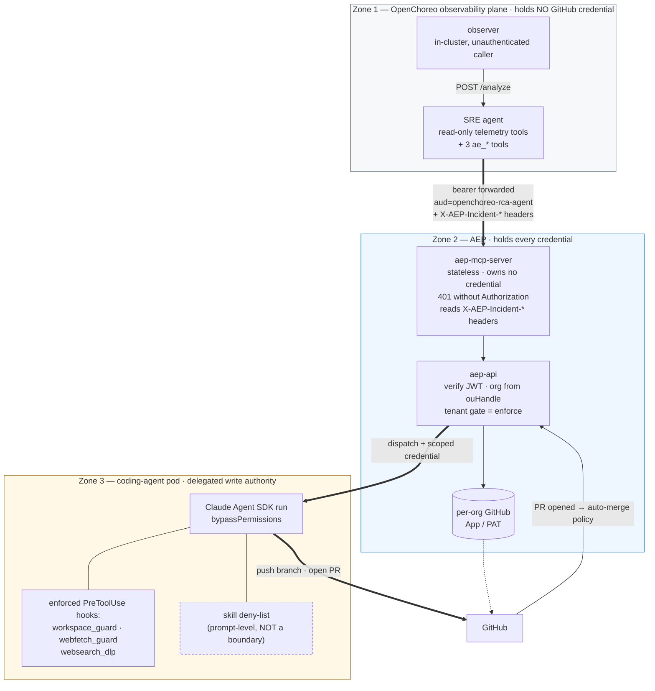
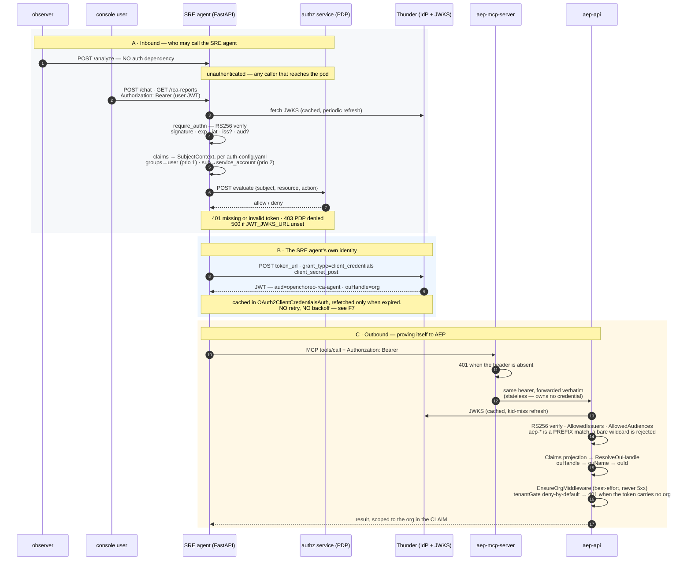
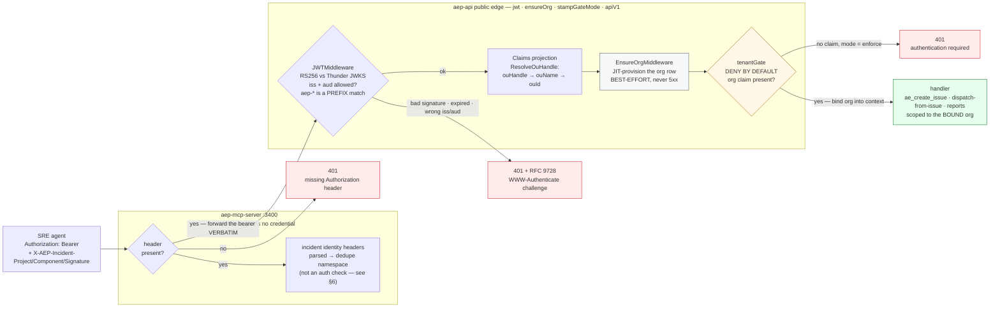

# SRE-agent ↔ AEP handoff — how security is handled

The handoff lets an **alert** end in **deployed code**. This document states what
protects each step, what the actual enforcement mechanism is (as opposed to the
intent), and where the gaps are.

Companions: [`sre-handoff-runbook.md`](./sre-handoff-runbook.md) (how to run it) ·
[`sre-agent-review-guide.md`](./sre-agent-review-guide.md) (how to review it).

> **Read §4 before enabling this anywhere that is not a local demo.** On the
> default local stack the human review gate the design leans on is **switched
> off**, and the chain from alert to deployed code is fully autonomous.

---

## 1. Trust zones

📎 PNG: [`images/sre-handoff-trust-zones.png`](./images/sre-handoff-trust-zones.png)



The design intent is that **privilege decreases with distance from AEP**: the SRE
agent can ask for an issue and a dispatch but holds no GitHub credential; the MCP
wrapper holds nothing at all; AEP holds the credentials and makes every
authorization decision. That intent is met. What is weaker than the design
document implies is the **last** zone — see §3 and §4.

---

## 2. Identity and authorization

There are **three separate authentication concerns**, and conflating them is the
usual source of confusion: who may call the SRE agent (A), how the SRE agent
proves *its own* identity (B), and how AEP verifies that proof (C).

📎 PNG: [`images/sre-handoff-auth.png`](./images/sre-handoff-auth.png)



Three properties this diagram is here to make obvious:

1. **`POST /analyze` has no authentication.** `/chat` and every report route carry
   `require_authn` plus a PDP authorization check; `/analyze` carries neither
   (`src/api/agent_routes.py:75`). Containment is network-level only.
2. **The SRE agent is a confidential OAuth2 client, not a user.** It holds
   `OAUTH_CLIENT_ID`/`SECRET` and mints its own token via client-credentials. Its
   token carries `ouHandle`, which is the *only* thing that binds it to an org.
3. **The token is verified twice, by two different verifiers** — once by the SRE
   agent for inbound requests (PyJWT + PyJWKClient), once by aep-api for outbound
   ones (`jwtassertion`, RS256/JWKS). They share Thunder as issuer but are
   independently configured, so `iss`/`aud` can be enforced on one side and not the
   other.

### 2.1 The AE-side chain, layer by layer

Every SRE call lands on the ordinary public edge — there is no SRE-specific auth
path. One line in `edge/surfaces.go` wraps the whole surface:

```go
mux.Handle("/api/", jwt(ensureOrg(stampGateMode(apiV1))))
```

📎 PNG: [`images/sre-handoff-ae-auth-chain.png`](./images/sre-handoff-ae-auth-chain.png)



Two steps are omitted from the diagram because they are not auth decisions:
`stampGateMode` (puts `enforce` or `log` on the request context) and Huma's
contract validation (checks the request against the committed spec) sit between
`EnsureOrgMiddleware` and `tenantGate`.

Four properties of this chain worth holding onto:

- **Fail-closed at boot.** `JWKS_URL` is required config: *"Without JWKS the inbound
  verifier rejects every /api/ request (401) — there is no unsigned-claim fallback."*
  A misconfigured deployment does not start, rather than starting open.
- **`EnsureOrgMiddleware` is not a security control.** It is JIT tenant onboarding
  and is deliberately best-effort. The gate below it is what denies.
- **`tenantGate` is the real boundary, and it is deny-by-default over every
  generated operation** — not opt-in per route. Exactly one carve-out exists
  (`ListOrganizations`, for the org switcher shown before a claim exists), and an
  arch test pins that list against the contract, so forgetting to gate a new
  operation is not representable.
- **Cross-org access is unrepresentable, not merely checked.** There is no org
  path, query, or body parameter anywhere on the public edge — the org comes only
  from the verified claim. The code calls this the IDOR fence. Note this is *not*
  a path-vs-claim mismatch check, which is what `config.go`'s own comment still
  claims.

The single SRE-specific accommodation in all of the above is one list entry:
`JWT_AUDIENCE`, whose code default is `aep-bff` and which compose widens to
`aep-*,openchoreo-rca-agent`. Without that, the RCA token is rejected at step `J2`.

| Hop | Credential | Enforcement | Where |
|---|---|---|---|
| observer → SRE agent | none | **none** — any in-cluster caller that reaches the pod can queue an analysis | — |
| SRE agent → telemetry MCP servers | Thunder client-credentials | read-only tool allow-list | `src/agent/tool_registry.py` |
| SRE agent → aep-mcp-server | same token, `aud=openchoreo-rca-agent` | `401` when `Authorization` absent | `aep-mcp-server/src/main.ts:50` |
| aep-mcp-server → aep-api | caller's bearer, forwarded verbatim | `JWTMiddleware` (RS256/JWKS, `AllowedIssuers` + `AllowedAudiences`) → `Claims` → `ResolveOuHandle`; acting org bound from the **verified** claim, never a path param | `internal/platform/auth/jwt.go`, `orgensure.go` |
| any AEP route | — | `tenantGate` is **deny-by-default** on every generated operation: no org claim → `401` in `enforce` (the default). There is no org path/query/body input on the public edge at all, so a cross-org request is unrepresentable | `internal/edge/tenant_gate.go` |
| aep-api → GitHub | per-org GitHub App / PAT | never leaves AEP | `internal/sourcecontrol` |
| coding agent → GitHub | AEP-issued, scoped credential | never in a git URL or in `argv`; shape-based redaction as a second line | `lib/git_clone.ts`, `codingagent/redact.go` |

Two properties worth stating explicitly because they are easy to lose:

- **The SRE agent never holds a GitHub credential.** Its entire write capability
  is three MCP tools. Compromising it does not yield repo access — it yields the
  ability to file an issue and request a dispatch in one org.
- **The acting org is never taken from the request.** It comes from the verified
  token claim, so a token for org A cannot act on org B by changing a path.

### The audience widening

Compose sets `JWT_AUDIENCE: aep-*,openchoreo-rca-agent` so aep-api will accept
the RCA agent's client-credentials token. This widens the accepted audience for
**every** aep-api route, not just the three the handoff needs. The SRE agent's
token is therefore accepted anywhere a user JWT is, within its org. Scoping the
RCA audience to the handoff surface is an open item (review guide **L3**).

---

## 3. What actually contains the coding agent

This is the section most likely to be misread, because the intent and the
mechanism differ.

**`allowedTools` restricts nothing.** The run sets `bypassPermissions` plus
`allowDangerouslySkipPermissions`, so every harness tool is callable whether or
not it appears in `BASE_ALLOWED_TOOLS` — measured on a live run, per the comment
at `runners/remote-worker/src/lib/runner.ts:77`. `BASE_ALLOWED_TOOLS` documents
intent; `DISALLOWED_TOOLS` is the list that holds, and what it removes is the
harness's **session-management** surface (schedulers, task channels, interactive
prompts) — not git, not shell.

**What is genuinely enforced** are `PreToolUse` hooks in the runner:

| Hook | Enforces |
|---|---|
| `workspace_guard.ts` | `Write`/`Edit`/`NotebookEdit` confined to the workspace, plus temp and dot-directories under `$HOME`. A visible sibling checkout stays denied. Bash is **not** gated — the pod is the containment boundary. |
| `webfetch_guard.ts` | SSRF guard, fail-closed: no internal/private/link-local/metadata addresses, no staged secret in a fetched URL |
| `websearch_dlp.ts` | DLP on outbound search terms |
| `fanout_foreground.ts` | subagents run in the foreground, so their output is not lost |
| console scrubber | runner `console.*` is scrubbed before it reaches the user-facing progress feed |

**What is *not* enforced by a boundary:** "never run `gh pr merge` / `gh pr close`
/ `gh repo delete`", "never force-push `main`", "never modify branch protection,
secrets, repository settings, collaborators, or webhooks". Those are the **Never**
list in `skills/aep/SKILL.md` — a *prompt-level* rule given to the model, not a
tool restriction. The credential the pod holds can do all of them.

That is a deliberate trade (blocking shell wholesale would end the run), but it
means the correct statement is *"the agent is instructed not to"*, not *"the agent
cannot"*. Any claim of the second kind in a design doc should be corrected.

---

## 4. Human-in-the-loop — and why the default stack has none

`AE-HANDOFF-DESIGN.md` §10 names this as the principal safety control:

> **No auto-merge** — the coding agent opens a PR only; human review/merge is the
> gate.

The agent-side half is true: `gh pr merge` is on the skill's Never list. **But AEP
merges on the platform side, independently of the agent.** `decideAutoMerge`
(`internal/delivery/eventcore/policy.go`) runs from `OnPullRequest`
(`events.go:234`) and squash-merges through `Merger.MergePullRequest`
(`merge.go:70`) the moment a qualifying PR opens. `skills/aep/SKILL.md:282` says
so in as many words: *"The platform merges the PR; no human reviews it."*

**The gate does not exist.** `AUTO_MERGE_CODING_PRS` is parsed into
`Config.AutoMergeCodingPRs` (`config_loader.go:58`) and **never read anywhere else
in the service** — `grep -rn AutoMergeCodingPRs services/aep-api/` returns only its
declaration, its loader line, and unrelated `decideAutoMerge` identifiers.
`OnPullRequest` consults no flag. Auto-merge is therefore **unconditional**, and
setting `AUTO_MERGE_CODING_PRS=false` changes nothing.

| Flag | Declared default | Local stack | Actually consumed? |
|---|---|---|---|
| `AE_HANDOFF` (`src/config.py`) | `False` | `true` (`setup-observability.sh:127`) | yes — gates the handoff stage |
| `AE_AUTO_DISPATCH` (`src/config.py`) | `True` | `true` | yes — gates the dispatch call |
| `AUTO_MERGE_CODING_PRS` (`internal/config/config.go:77`) | `false`, commented "secure default" | `"true"` (`docker-compose.yml:124`) | **NO — dead config** |

What actually decides a merge is `decideAutoMerge`: a **non-draft** PR whose
`Resolves` list names at least one issue carrying `aep` or `aep:validation` in the
run's milestone is squash-merged. An SRE-filed issue is adopted into that milestone
and stamped `aep`, so it qualifies by construction. There is deliberately no
pre-merge verification — the post-merge build is the check, and a red build mints a
fix issue rather than blocking.

Composed, on the default local stack:

```
ERROR log → alert → RCA → issue → coding agent → PR
          → squash-merged on open → build → deploy
```

**No human in that chain, and no supported way to put one there.** For a local demo
that is the point. But because the flag is inert, an operator who reads `config.go`,
sets `AUTO_MERGE_CODING_PRS=false` and concludes the gate is closed will be wrong —
the next qualifying PR merges anyway. False assurance is worse than a known-open gate.

Until the flag is wired (or deleted), the only things that actually stop an
auto-merge sit **outside** this config: GitHub branch protection requiring a review
on the default branch, or not enabling `AE_HANDOFF` / `AE_AUTO_DISPATCH` at all.

---

## 5. Untrusted content reaching an agent

`ae_search_related_issues` returns **full issue bodies** into the handoff agent's
context. The handoff agent writes an issue body. That body becomes the coding
agent's prompt. So:

> text written by anyone who can open an issue or comment in the repo reaches an
> agent that holds a write credential.

No delimiting, truncation, or instruction-hierarchy framing was found in
`skills/coding-agent-handoff/SKILL.md` on the reviewed SHAs. Combined with §4's auto-merge,
the worst case is that repository-visible text influences code that deploys
without review.

Mitigations to put in place (none of these is currently implemented):

- frame retrieved issue bodies as **data, not instructions**, in the handoff
  prompt, and truncate them;
- require a review via **branch protection** wherever the repo accepts issues from
  outside the team — this is the control that actually caps the blast radius;
- treat the `ae_*` tool surface as the only write path the SRE agent gets, and
  resist adding a fourth.

The `webfetch_guard` / `websearch_dlp` hooks already handle the *outbound* half of
this problem (exfiltration via fetch or search). The inbound half is open.

---

## 6. Secrets, logging, and data handling

**Secrets.**

- The SRE agent holds Thunder client credentials and an LLM API key; it holds no
  GitHub credential.
- `dedupeKey` is an AEP-internal field and is stripped before the request reaches
  GitHub (`internal/sourcecontrol/issue_service.go:189`).
- `aep-mcp-server` logs diagnostic notes to stderr (`src/main.ts`,
  `src/server.ts`) when an identity header is unreadable or overrides a
  model-supplied argument. That is a real, if thin, audit trail at the
  boundary — but it is never the bearer: the token itself is never logged,
  only forwarded (see §7 for what this trail does and does not cover).
- Coding-agent credentials never appear in a git URL or in `argv`; `redact.go`
  is a shape-based second line for anything forwarded to a console build log.

**Telemetry and personal data — the weakest area.** RCA reports and the issue
bodies built from them carry **raw log lines and trace data**, pulled straight
from the workload. Raw application logs routinely contain personal data, tokens,
and internal identifiers. On the reviewed SHAs:

- no masking or redaction was found on the path from evidence → issue body → GitHub;
- no masking was found on `POST /api/v1/rca-agent/reports` → `rca_agent_reports`;
- no retention policy for `rca_agent_reports` was found.

Consequences worth being explicit about: an issue body is written to **GitHub**,
which for a public repo is a public disclosure, and for a private one is still a
copy outside AEP's own store. Anyone enabling `AE_HANDOFF` against a repo that
carries production telemetry should treat this as an unresolved data-protection
question and get it reviewed before enabling, not after. Tracked as **F11** in the
review guide.

---

## 7. Auditability

What is recorded:

- `HandoffResult` on the RCA report — classification, created issue number/URL,
  dispatch run name, related issues, rationale. Persisted with the report.
- The `milestone_runs` / `run_cycles` rows for the incident run the adoption started.
- The console Alerts surface, when `AE_PUBLISH_REPORTS` is on.
- GitHub's own trail: issue creation, labels, PR, merge commit.
- `aep-mcp-server` writes stderr notes at the boundary the SRE agent actually
  crosses: an identity header that was unreadable, or that overrode a
  model-supplied `project`/`componentName`. This is process stderr, not a
  structured or persisted log — there is no store, no query surface, and
  nothing correlates it back to a specific incident after the fact.

Gaps:

- `aep-mcp-server`'s stderr notes are not persisted or queryable, so they do
  not substitute for a real audit trail — only aep-api's logs downstream of it
  are.
- The `observer → /analyze` call is unauthenticated, so an analysis cannot be
  attributed to a caller.

---

## 8. Supply chain

- `setup-observability.sh` defaults to a **personal** Docker Hub namespace
  (`tharindulak/sre-agent:handoff-provider`) and pins a **forked**
  third-party adapter (`tharindulak/observability-logs-opensearch-adapter:0.5.1-case-insensitive`).
  The fork has a legitimate reason (case-insensitive alert matching, pending
  upstream); the namespace is the problem. Both should move to a WSO2/OpenChoreo
  registry, and the fork needs an upstream tracking issue with a drop condition.
  Tracked as **F3**.
- The `coding-agent-handoff` skill is delivered at deploy time from a ConfigMap rendered out
  of this repo, and the agent's loader searches the mount **before** its built-in
  copy. Whoever can patch that ConfigMap can change the handoff agent's
  instructions. That is the intended ownership model (AEP owns the skill), but it
  is a privileged write path and should be treated as one.
- `mermaid-cli`, used to export the diagrams in these docs, is deliberately **not**
  a repo dependency — it pulls a Chromium. It is installed in a throwaway
  directory and renders locally.

---

## 9. Summary of open items

| # | Item | Severity | Tracked as |
|---|---|---|---|
| 1 | Auto-merge is unconditional — `AUTO_MERGE_CODING_PRS` is dead config, so the documented gate cannot be closed from configuration at all | **High** — wire the flag, or gate on branch protection | F13 |
| 2 | Raw telemetry (possible PII/secrets) reaches GitHub issue bodies and `rca_agent_reports` unmasked; no retention policy | **High** | F11 |
| 3 | Untrusted issue text reaches an agent with write authority; no delimiting or truncation | **Medium-High** | F8 |
| 4 | "No merge / no force-push / no settings changes" is a prompt-level rule, not a boundary | **Medium** — accept, but document accurately | §3 |
| 5 | `JWT_AUDIENCE` widening applies to every aep-api route | **Medium** | L3 |
| 6 | Default images from a personal registry; forked adapter | **Medium** | F3 |
| 7 | `observer → /analyze` is unauthenticated and unattributable | **Low** in-cluster, but no audit trail | §7 |
| 8 | No audit record at the `aep-mcp-server` boundary | **Low** | §7 |

Severities are this document's assessment on the reviewed SHAs, not a formal risk
rating. Items 1 and 2 should be settled before the handoff is enabled anywhere
that is not a local demo; the rest can be follow-ups.

---

## 10. Before enabling the handoff — checklist

- [ ] Auto-merge is actually blocked — by **branch protection requiring a review**, not by `AUTO_MERGE_CODING_PRS`, which is inert. Verify by opening a throwaway qualifying PR and confirming it does not merge itself.
- [ ] A named human owns review of coding-agent PRs, and branch protection requires it.
- [ ] The target repo's telemetry exposure is understood and accepted, or masking is in place (§6).
- [ ] `AE_HANDOFF` / `AE_AUTO_DISPATCH` are set deliberately per environment, not inherited from the local script's defaults.
- [ ] Images come from an org registry (§8).
- [ ] The org's GitHub credential is scoped to the repos the handoff may touch.
- [ ] Someone has read §3 and accepts that the agent's git restrictions are instructions, not a sandbox.
