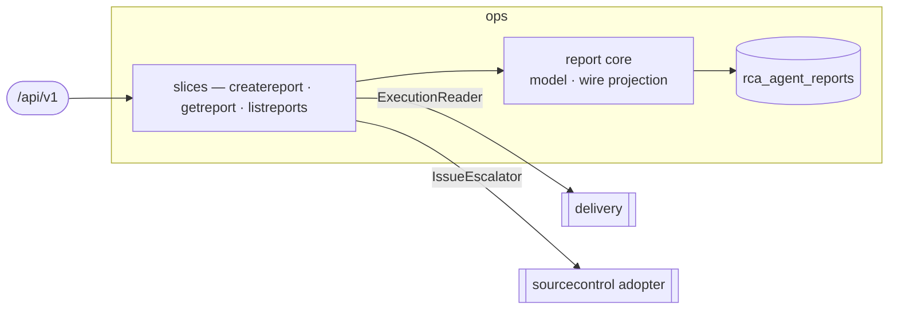

# ops — Incident RCA

> **L2 · a domain.** Part of the [aep-api architecture](../../README.md).

Capture RCA-agent incident reports and correlate them with live Task executions, so the console's
Alerts bell and stepper show the *current* state rather than the write-time snapshot. Also the last
gate on a handoff's decision: a high-confidence root cause the SRE agent declined is filed and
dispatched here rather than dropped.

## Slices
| Slice | Use-case | Entry |
|---|---|---|
| `createreport` | record a handoff report | `POST /rca-agent/reports` |
| `getreport` | read one, reconciled against live executions | `GET /rca-agent/reports/{reportId}` |
| `listreports` | keyset page, newest first | `GET /rca-agent/reports` |

## Ports
| Port | Dir | Peer · contract |
|---|---|---|
| `Repository` | needs | own store — `repository.go` (the only gorm file) |
| `ExecutionReader` | needs | `delivery` — latest execution per kind for a Task. **Optional**: nil disables correlation (satisfied by delivery's `execution.OpsExecutionReader`) |
| `IssueEscalator` | needs | the same `sourcecontrol.Adopter` create-issue uses, so an escalated issue is indistinguishable from one the handoff filed. **Optional**: nil stores a declined report unchanged (satisfied by app's `opsIssueEscalator`) |

## Owns
- `rca_agent_reports` — gorm in this domain (`repository.go` over `model.go`), single write-authority.
  Created by `internal/migrate`'s `phase10_rca_agent_reports` step, not AutoMigrate.

## Escalation — filing what the handoff declined
`createreport` files the issue itself when a report arrives **without** one, classified `none` or
`config-level`, carrying at least one recommended action the remediation agent could not express as
configuration (`_(suggested)_`). Anything else is left alone, and the reason is logged.

**Any code the RCA suspects is handed over.** Confidence is deliberately not a gate — a
low-confidence root cause with an unaddressed code-level action is still an unaddressed code-level
action, and the costs are asymmetric: an unfiled defect is dropped for good, an unnecessary issue is
closed in minutes. Nor is a spec conflict grounds to withhold: "this would break an acceptance
criterion" is stated IN the issue, because the criterion may be what is wrong and a requirement
nobody is shown is a requirement nobody can correct. The coding agent has the repository and
decides; `not_planned` is a first-class answer (ADR-0023).

The rule lives here because this is the only path AEP sees every report on and the handoff cannot
skip it. The skill tells the handoff that the classification is *settled* before its stage runs;
escalation is what makes the filing settled too, rather than merely requested. Guidance was tried
first and did not hold: the `coding-agent-handoff` skill already names this exact scenario as the
likeliest way to get the decision wrong, and a report was still declined by an agent running the
updated skill.

Three properties the escalated issue must keep:
- **A `## Before you change a default` section** naming `specs/validation/validation-criteria.json`
  and demanding a list of affected criteria. An earlier escalated fix carried a prose "preserve every
  default" paragraph and moved a default anyway, failing criteria that had been passing — a step with
  an output is harder to skim past than an exhortation. The wording stays generic about WHICH values
  matter; the criteria file is what supplies the specifics for a given project.
- **The handoff's reasoning, quoted** from the report's `## Handoff decision` section, so the coding
  agent inherits the argument against the work instead of rediscovering it.
- **The spec conflict stated, never used to withhold.** See above.

## Invariants — don't break
- **Escalation never fails the write.** A report that cannot be stored is an incident nothing
  recovers, so a filing failure is logged and the report is persisted without an issue.
- **The write body is the agent's own report, and this domain does the mapping.** `create-report`
  accepts one field — `report`, the SRE agent's report document, deliberately unmodelled in the
  contract — and every column is derived from it in `createreport/native.go`. That is what lets the
  agent's publisher stay generic: the side that owns this contract owns the translation, so an AEP
  field rename is not a change to the OpenChoreo repository. A report that cannot fill the row is a
  400 naming fields of the REPORT, since that is what the caller can act on.
- **Escalation reads the decision from FIELDS, never from prose.** It used to recover the recommended
  actions out of the rendered `diagnosis` by anchored regex — an undocumented text format acting as a
  cross-repo contract, where reordering one line in another repository would have silently stopped
  escalation. The actions now arrive structured. The escalated issue still quotes the handoff's
  reasoning by slicing the `## Handoff decision` section out of `diagnosis`, which is display-only,
  fails safe to an empty quote, and reads markdown this domain itself renders.
- **Correlation only promotes false→true**, and is best-effort: a lookup failure serves the stored
  snapshot rather than failing the read. `Deployed` requires a *succeeded* build (the "Verify Fix"
  threshold), not merely a build.
- **An empty page marshals to `"items":null`**, not `[]` — the contract marks `items` nullable and the
  mapping in `wire.go` preserves nil deliberately.
- `ExecutionFact` is ops' own vocabulary, not delivery's entity — the decoupling that lets ops read
  delivery through a port it owns.
- Platform-wide rules (tenant gate, secrets fence) → [../../README.md](../../README.md).
