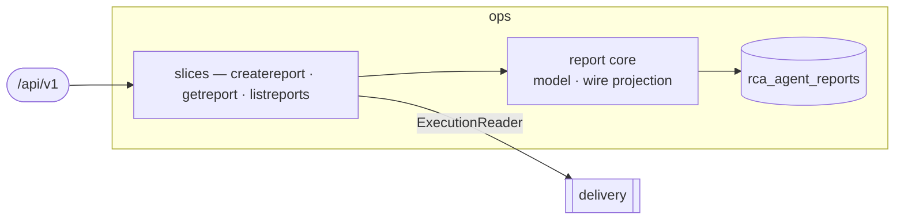

# ops — Incident RCA

> **L2 · a domain.** Part of the [aep-api architecture](../../README.md).

Capture RCA-agent incident reports and correlate them with live Task executions, so the console's
Alerts bell and stepper show the *current* state rather than the write-time snapshot.

## Slices
| Slice | Use-case | Entry |
|---|---|---|
| `createreport` | record a handoff report | `POST /rca-agent/reports` |
| `getreport` | read one, reconciled against live executions | `GET /rca-agent/reports/{reportId}` |
| `listreports` | keyset page, newest first | `GET /rca-agent/reports` |

## Ports
| Port | Dir | Peer · contract |
|---|---|---|
| `Repository` | needs | own store — `repository.go` (the only gorm file) |
| `ExecutionReader` | needs | `delivery` — latest execution per kind for a Task. **Optional**: nil disables correlation (satisfied by delivery's `execution.OpsExecutionReader`) |

## Owns
- `rca_agent_reports` — gorm in this domain (`repository.go` over `model.go`), single write-authority.
  Created by `internal/migrate`'s `phase10_rca_agent_reports` step, not AutoMigrate.

## Invariants — don't break
- **The write body is the agent's own report, and this domain does the mapping.** `create-report`
  accepts one field — `report`, the SRE agent's report document, deliberately unmodelled in the
  contract — and every column is derived from it in `createreport/native.go`. That is what lets the
  agent's publisher stay generic: the side that owns this contract owns the translation, so an AEP
  field rename is not a change to the OpenChoreo repository. A report that cannot fill the row is a
  400 naming fields of the REPORT, since that is what the caller can act on.
- **Correlation only promotes false→true**, and is best-effort: a lookup failure serves the stored
  snapshot rather than failing the read. `Deployed` requires a *succeeded* build (the "Verify Fix"
  threshold), not merely a build.
- **An empty page marshals to `"items":null`**, not `[]` — the contract marks `items` nullable and the
  mapping in `wire.go` preserves nil deliberately.
- `ExecutionFact` is ops' own vocabulary, not delivery's entity — the decoupling that lets ops read
  delivery through a port it owns.
- Platform-wide rules (tenant gate, secrets fence) → [../../README.md](../../README.md).
