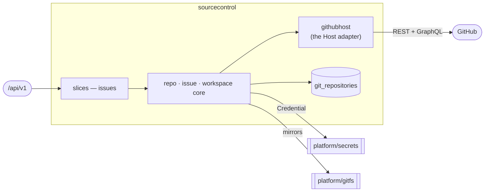

# sourcecontrol — Source Control & Webhooks

> **L2 · a domain.** Part of the [aep-api architecture](../../README.md).

The git-host integration substrate every other domain builds on: per-project
repo/issue/milestone/PR/webhook lifecycle over a provider-neutral `Host` port, and the bare-mirror
workspace behind `platform/gitfs`.

## Slices
| Slice | Use-case | Entry |
|---|---|---|
| `issues` | file / search a project's issues — and filing ADOPTS by default: the issue is handed to the coding agent unless the caller passes `adopt: false` | `POST`+`GET /projects/{projectName}/issues` |

*Still in the domain root (not carved into slices): repo lifecycle, workspace, webhook register/receive,
and installation lifecycle.*

## Ports
| Port | Dir | Peer · contract |
|---|---|---|
| `Host` | needs | the git host — implemented by `githubhost` (the domain's own adapter; it lives here, not in `platform/clients`, because an adapter for a domain's port cannot sit in a domain-free kernel) |
| `secrets.Credential` | needs | `platform/secrets` — App-installation / per-org PAT |
| `IssueService`, `RepoService` | offers | every domain that needs repos, issues or milestones |
| `Adopter` | needs | `delivery`'s event plane — files an issue that is agent work from the moment it exists (milestone + labels on the create call, then a run started or woken). Optional: nil degrades create-issue to filing alone |

## Owns
- `git_repositories` (the repo coordinate registry) and `webhook_deliveries` — gorm + entities in this
  domain (`repository_repo.go` · `repository_webhook_delivery.go` over `repository_entity.go` /
  `webhook_delivery.go`), single write-authority. `GitRepository` is not `x-go-type`-aliased, so it needs
  no wire split.
- The bare-mirror workspace handle, and the GitHub host connection state.

## Invariants — don't break
- **Filing an issue through the API dispatches it.** `create-issue`'s `adopt` defaults to TRUE, and the
  default is the point: an issue filed here with nothing to work it is a ledger entry that looks exactly
  like accepted work, which is how an SRE handoff was once silently dropped. A caller that wants a ledger
  entry says so, and the answer names what happened either way (`adopted`, `adoptionError`). The default
  lives in a POINTER on the generated request type — as a value `bool`, an omitted field would arrive as
  `false` and turn dispatch off for every caller that never heard of the flag.
  *Only the HTTP surface adopts.* The dozen in-process callers of `IssueService.CreateIssue` — provision
  gates, validation, repair, conformance, the plan tap, the mint paths — are untouched, and must stay so:
  a provision gate exists to HOLD dispatch, and a red-main issue is deliberately never dispatched.
- **`Host` is provider-neutral.** GitHub specifics live in `githubhost`; nothing above it names GitHub
  — including whether an op rides REST or GraphQL.
- **A milestone is addressed by NUMBER, never by title.** Titles are renamable, and the host enforces
  title uniqueness case-sensitively while filtering on it case-insensitively, so the adapter enforces
  case-insensitive uniqueness at create and callers key on the number. Issue counts come from the
  GraphQL predicate; a milestone's `open_issues` counts pull requests and is never read.
- **`MilestoneIssueCounts` is ONE call, and its exclusions are computed in ONE place.** The dispatch
  predicate runs at every cycle boundary, so the gate and working-set populations ride a single
  aliased GraphQL query. GraphQL's `labels:` argument is a **UNION** — an issue matches when it
  carries ANY listed label — so an intersection is NOT expressible and the working set is taken as a
  DIFFERENCE of two unions instead: `|aep ∪ exclusions| − |exclusions|`. Callers read it through
  `OpenNonGateWork()` and never subtract fields themselves; the label kinds are not assumed disjoint,
  and the arithmetic must not be duplicated.
- **REST narrows on labels, GraphQL widens.** `ListMilestoneIssues`' REST `?labels=a,b` is AND (an
  issue must carry all of them); the GraphQL `labels:` above is OR. Two APIs over one resource, two
  rules — carrying an assumption from one to the other silently empties the working set, and the
  fakes on both sides model their own rule so a test cannot hide it.
- **A write's own result is the only reliable read of it.** GitHub's issue indexes lag a create by a
  beat, so `CreateIssue`'s number is authoritative while a label-filtered list moments later may not
  show the issue at all. Callers key on the returned number — `Deduped` names the case where that
  number is an existing issue's. Re-discovering a just-written issue by listing is how the run
  supervisor came to report a version `skipped` over an acceptance oracle it had itself just filed.
- Ports here are **nil-tolerant**: an unwired service answers 503, never panics — the component harness
  wires only the feature under test, and `edge`'s `sourceControlOrEmpty` preserves that for an unwired
  domain.
- `IssueInfo`'s wire keys are **CAPITALIZED** — a historical shape the deployed MCP server parses.
- Platform-wide rules (tenant gate, secrets fence) → [../../README.md](../../README.md).
